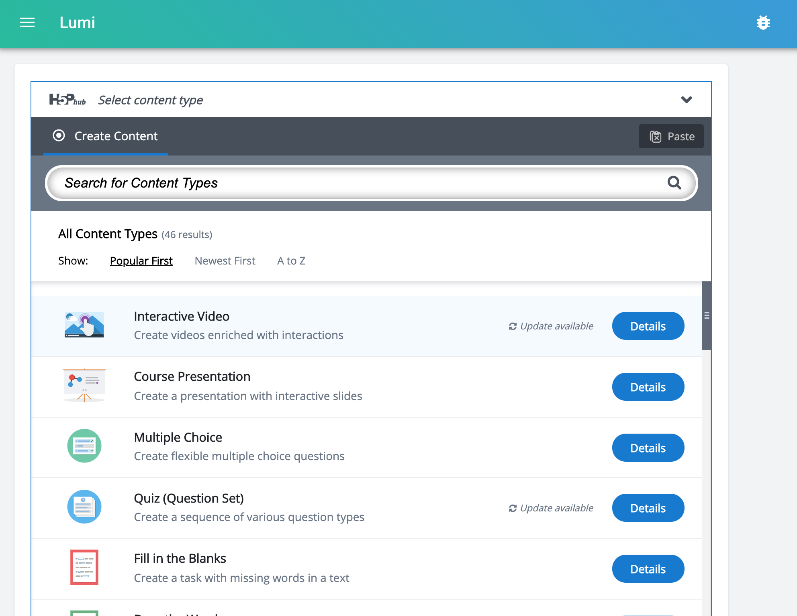

# Lumi

Lumi ist eine Desktop-Anwendung, die das Erstellen, Bearbeiten und Teilen von interaktiven Inhalten auf H5P-Basis ermöglicht.

* [Download](https://next.lumi.education/#download)
* [Erste Schritte](getting-started/installation.md)

