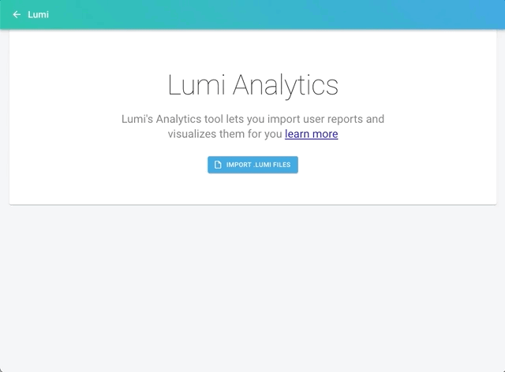
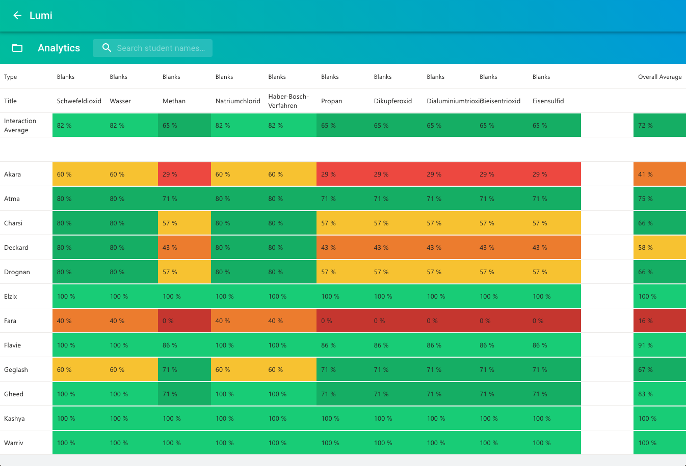

# What is Lumi Analytics?

Lumi Analytics lets you import user generated [reports](reporter.md) \(`.lumi` files\) and displays the user's progress and achievements. To start Lumi Analytics click on "Lumi Analytics" in the home screen. From there you can import several `.lumi` files or complete folders. Lumi Analytics imports these `.lumi` files and displays the result in a table:

