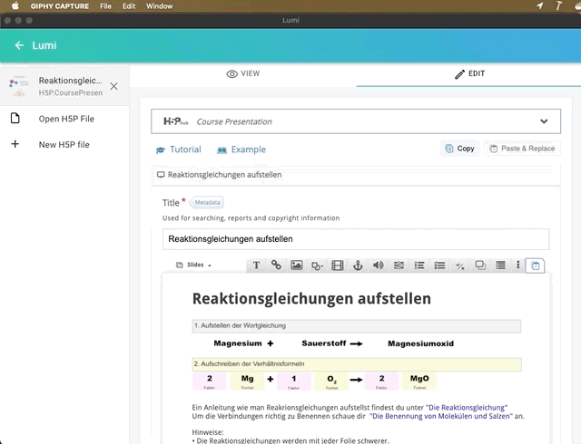
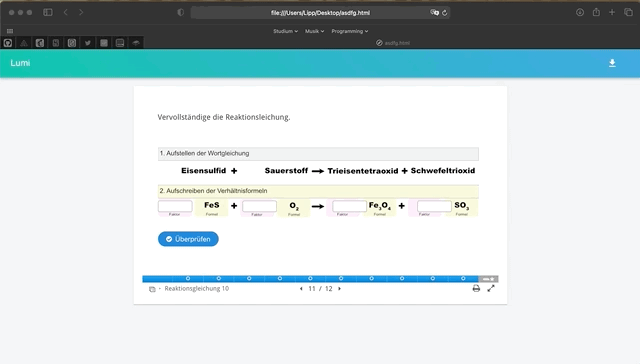

# Erste Schritte mit Lumi Analytics

Lumi ermöglicht beim [HTML-Export](../erste-schritte/teilen-mit-der-klasse.md) einen "Reporter" zu integrieren. Der Reporter soll der Lehrkraft einen Einblick in den Fortschritt seiner Lernenden ermöglichen. Dazu wird der Reporter in die exportiere HTML-Datei eingebunden und zeichnet dort alles auf, was der Lernende macht und erreicht. Der Bericht kann anschließend als `.lumi` Datei heruntergeladen werden und an die Lehrkraft zurück geschickt werden.

Der Reporter wird in die exportierte HTML Datei eingebunden und zeichnet auf, welche Anworten gegeben werden und was der Lernende erreicht. Die Ergebnisse stellt der Reporter über einen Button im rechten oberen Bildrand zur Verfügung. Nach dem Klick auf diesen Button wird man aufgefordert seinen Namen einzugeben und anschließend lädt der Browser eine Datei mit der Endung `.lumi` herunter:

Diese `.lumi` Datei kann anschließend vom Lernenden an die Lehrkraft geschickt werden, welcher diese wiederum in Lumi Analytics öffnen kann:

