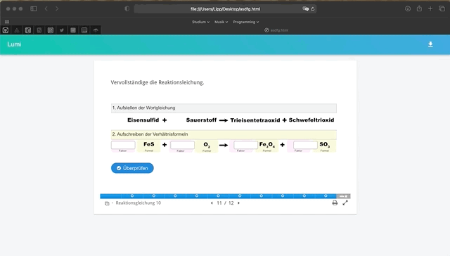

# Export der Report-Datei

1. Öffne die `.html` Datei mit Hilfe eines Browsers \(Safari/Firefox/Chrome/Edge\).
2. Bearbeite die Aufgaben.
3. Klicke im rechten oberen Rand auf den Pfeil.
4. Gib deinen Namen ein.
5. Der Browser lädt eine Datei mit der Endung `.lumi` herunter. Diese findest du in der Regel in deinem `Download`Ordner.

