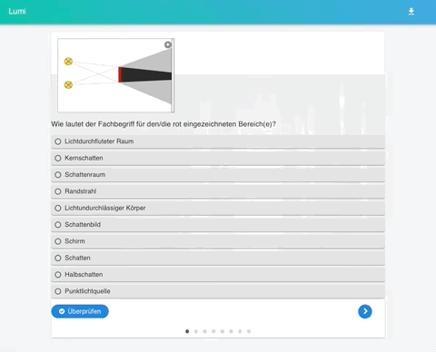

# Was ist Lumi Analytics?

Lumi ermöglicht beim [HTML-Export](../erste-schritte/teilen-mit-der-klasse.md) einen "Reporter" zu integrieren. Dieser zeichnet auf, welche Anworten gegeben werden und stellt am Ende eine Datei mit der Endung `.lumi` mit allen Informationen zur Verfügung:

Diese `.lumi` Datei kann anschließend vom Lernenden an die Lehrkraft geschickt werden.

