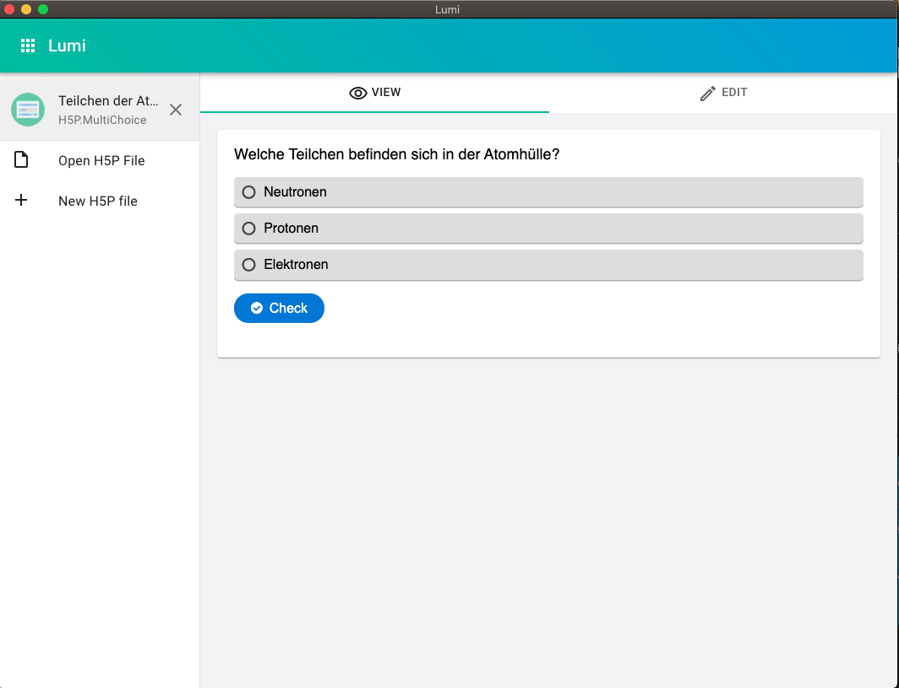

# Was ist Lumi?

Bislang war [H5P](h5p.md) an Lernplattformen wie Moodle oder Content-Management-Systeme wie Wordpress gebunden. Lumi bietet den H5P Editor als einfach ausführbare Anwendung für den Desktop an. 

## Verwendung

Nach dem Start von Lumi siehst du die Startseite. Dort kannst du auswählen, ob du etwas neues erstellen möchtest, oder bereits existierende .h5p Dateien öffnen möchtest. In diesem Beispiel wollen wir eine Multiple-Choice Frage erstellen. Also klicken wir auf "Create new H5P".

Im nächsten Schritt wählen wir den Inhaltstyp: Multiple Choice

Nun gibt man einen Titel, eine Frage und mögliche Antwortoptionen ein:

Über den "View" kann man sich das Endprodukt anschauen.

Um den Inhalt nun mit der Lerngruppe zu teilen kann das H5P als HTML exportiert werden: Mehr dazu [hier](teilen-mit-der-klasse.md)

