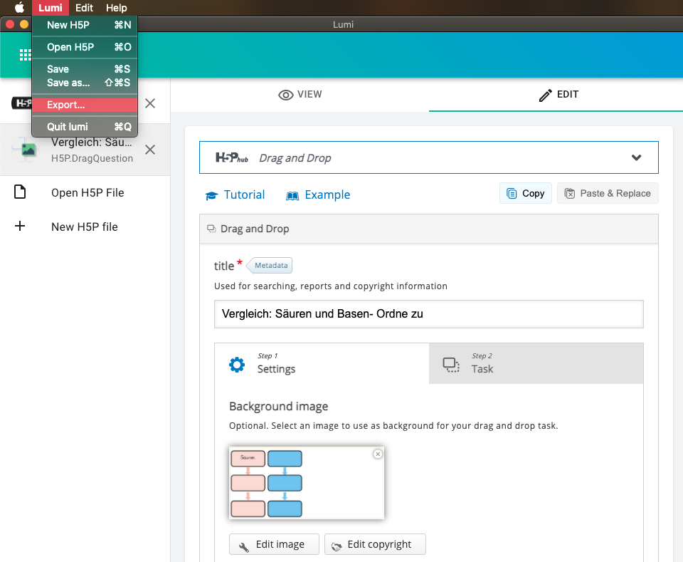
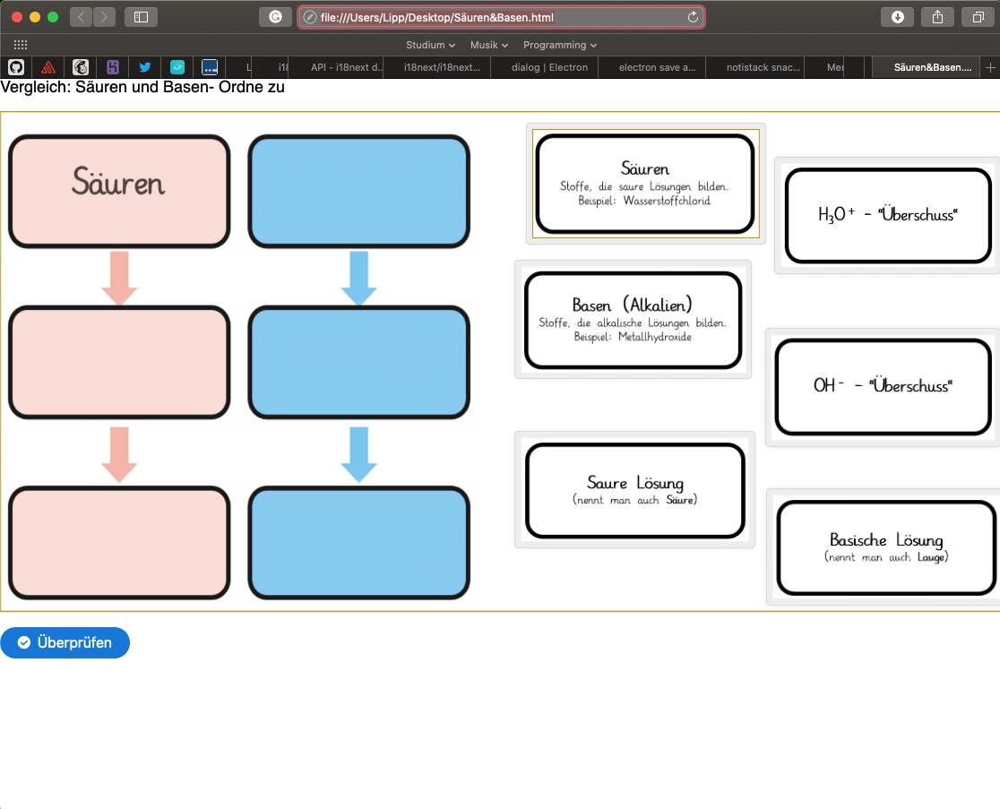
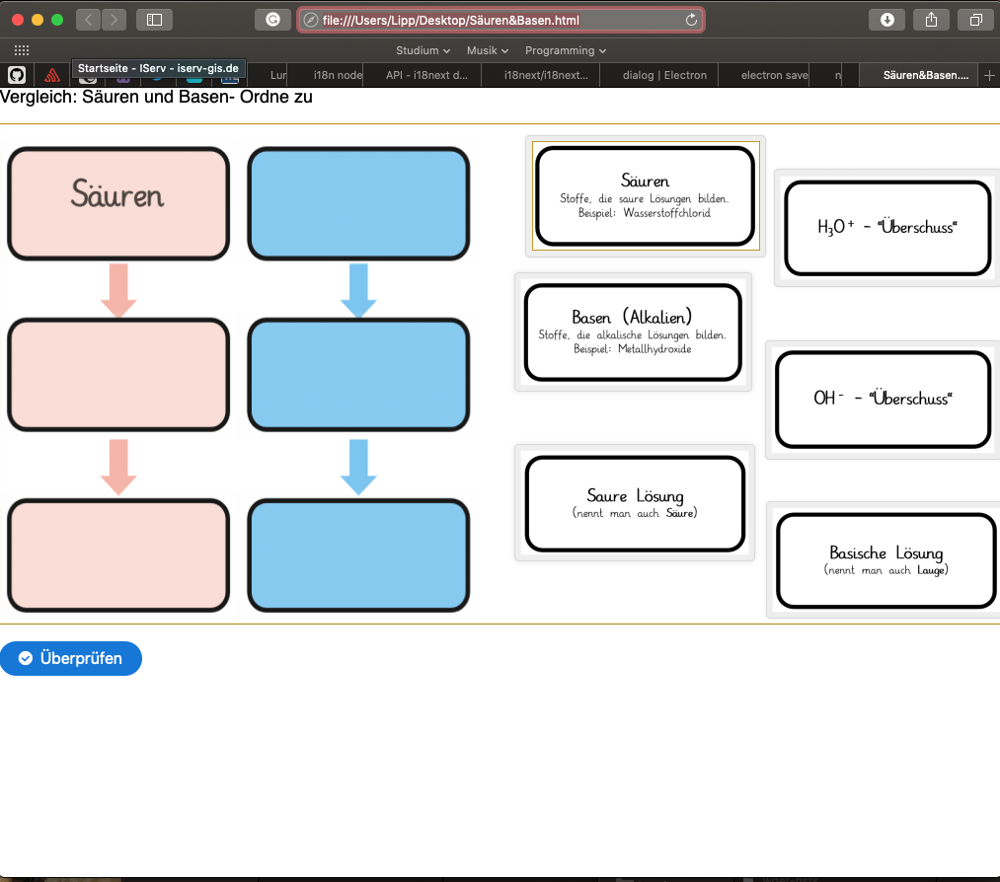

# Teilen mit der Klasse

Wenn du erfahren möchtest, was [H5P](h5p.md) oder [Lumi](lumi.md) ist, oder wie du Lumi [installierst](installation.md), dann klicke einfach auf die Links.

H5P zu erstellen ist eine Sache. Das erstelle H5P als Lernmaterial zur Verfügung zu stellen eine andere. Bislang waren dafür im Internet gehostete Webseiten nötig. Lumi bietet nun die Möglichkeit die H5P-Datei als HTML Datei zu exportieren!

Dazu musst du einfach im Menü auf "Export..." klicken:

Im nächsten Schritt wählst du einfach den Namen der HTML Datei und klickst auf "save".

Die erzeugte HTML Datei kann nun auf jedem Weg an die Lernenden gesendet werden. Ob über Email, WhatsApp, Dropbox, oder eigenes LMS ist egal. Die HTML Datei lässt sich dann von den Lernenden in jedem Browser öffnen und ausführen:

