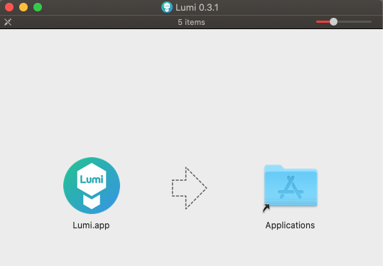

# Installation

## Download

Lade dir die App von [Lumi.education](http://Lumi.education) für dein Betriebssystem herunter.

## Installation unter macOS

Öffne die heruntergeladene .dmg Datei und ziehe die Lumi.app in den Anwendungs-Ordner.

Hinweis: Sollte sich die App nicht öffnen lassen, weil sie von einem unbekannten Entwickler stammt, so musst du folgendes tun:

* Rechtsklick auf die App
* Öffnen aus dem Dialog wählen
* Nochmaliges bestätigen des Öffnens

