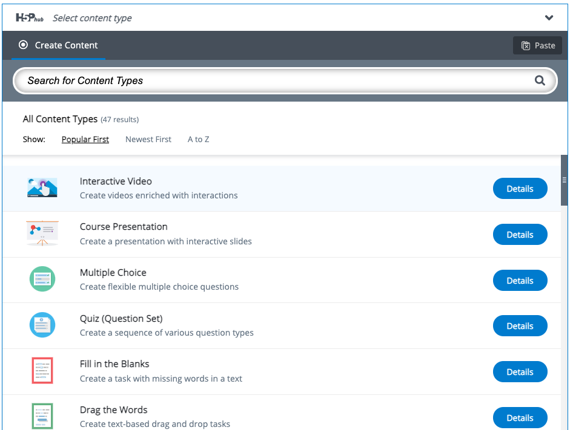
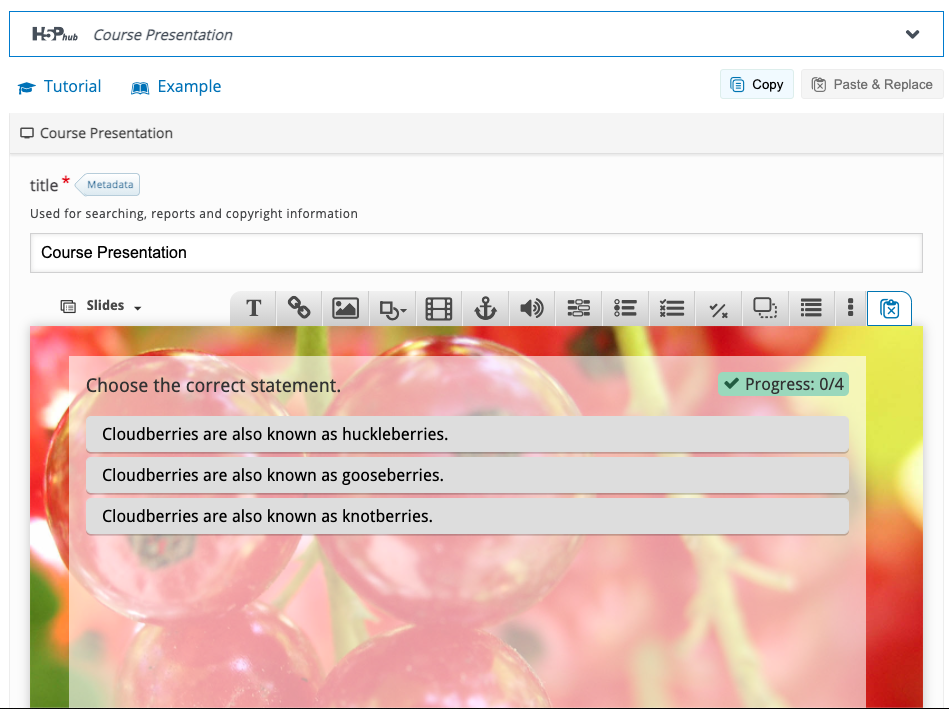
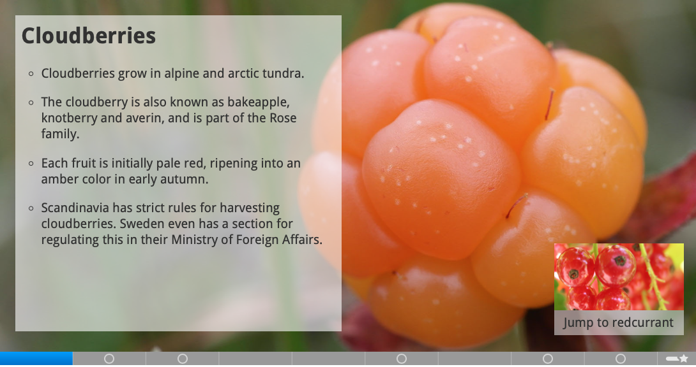

# H5P

## H5P - HTML 5 Package

**H5P** ist eine freie und quelloffene Software zum Erstellen von interaktiven \(Lern-\)Inhalten, die 20212 als Alternative zu Adobe Flash entwickelt wurde. \([Wikipedia](https://de.wikipedia.org/wiki/H5P)\)

**H5P** steht für **H**TML **5** **P**ackage und ist im Prinzip eine Webseite. Mit Hilfe des H5P Editors lassen sich somit interaktive Inhalte erzeugen, die auf Webseiten angezeigt werden können.

Die Open Educational Resources \(OER\) Bewegung hat in den letzten Jahren bereits einige Inhalte auf H5P-Basis erzeugt. So entstand zum Beispiel [https://apps.zum.de/apps](https://apps.zum.de/apps) - eine Sammlung von frei verwendbaren H5P Inhalten.

Zunächst wählt man im H5P Editor den Inhaltstypen:

Anschließend erstellt man mit Hilfe des Editors den Inhalt:

Der erstellte Inhalt kann anschließend auf einer Webseite eingebunden werden.

## 

