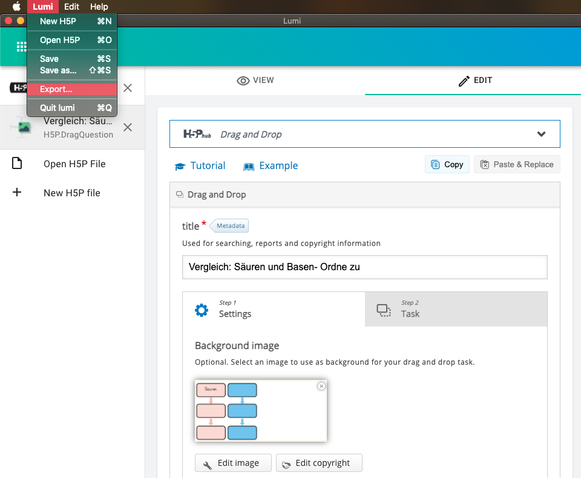
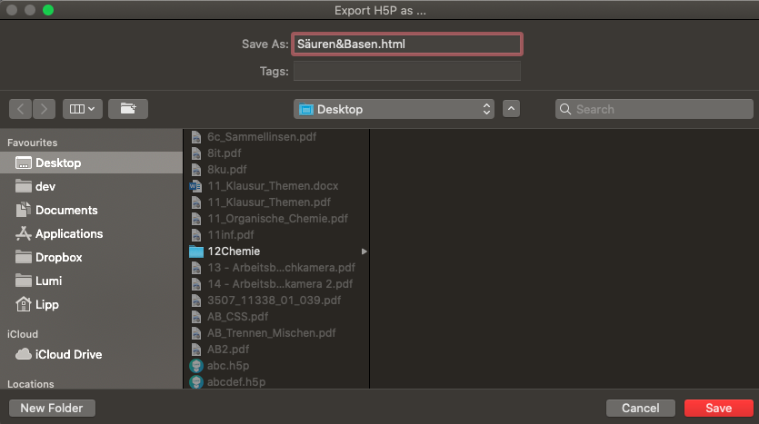

# How to share H5P content

If you want to know what [H5P](h5p.md) or [Lumi](lumi.md) is, or how you [install](install.md) Lumi, just click on the links.

Creating H5P is one thing. To make the H5P content available for your stundents another. Until now it was necessary to host the H5P content on a website in the internet. Lumi offers the possibilty to export your H5P Content as a single HTML file.

Just open the menu and click on "Export..." 

In the next step you give the HTML file a name and click on "save".

The generated HTML file can be distributed on any way. It doesn't matter if you send it via Email, WhatsApp, Dropxbox or a LMS. The HTML file can be opened by every browser.

